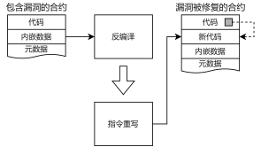

# 一种支持内嵌数据处理的智能合约漏洞修复方案

为解决现有智能合约漏洞修复方案修复成功率低的问题，提出一种支持内嵌数据处理的智能合约漏洞修复方案。

[论文链接](https://kns.cnki.net/kcms2/article/abstract?v=5DzVwdTmeh8wMJQmd5c1JtqU0bo_VLtiMXUrNfI8Udoi6i4bM_JDbo3UHGEWyHRVX7wn7dehtOssZiNXIaFFmlP26V9JyqZDUj0iGAeRDVJd4raNnjCgHq64VfgjOA_Z7QJhZlSdX0A=&uniplatform=NZKPT&language=CHS)

# 功能

- [x] 支持包含内嵌数据的智能合约漏洞修复
- [x] 支持复杂合约的漏洞修复

# 基本原理

漏洞修复分为两个步骤反编译与指令重写。

反编译中，基于内存拷贝指令构建内嵌数据定位算法，解析智能合约字节码结构；指令重写中，基于蹦床机制对智能合约字节码进行重写并修正内嵌数据地址偏移

# 表现

相比于EVMPatch，该方案合约字节码重写成功率提升了26.9%；相比于Smartshield，该方案能够更好地处理复杂合约。

